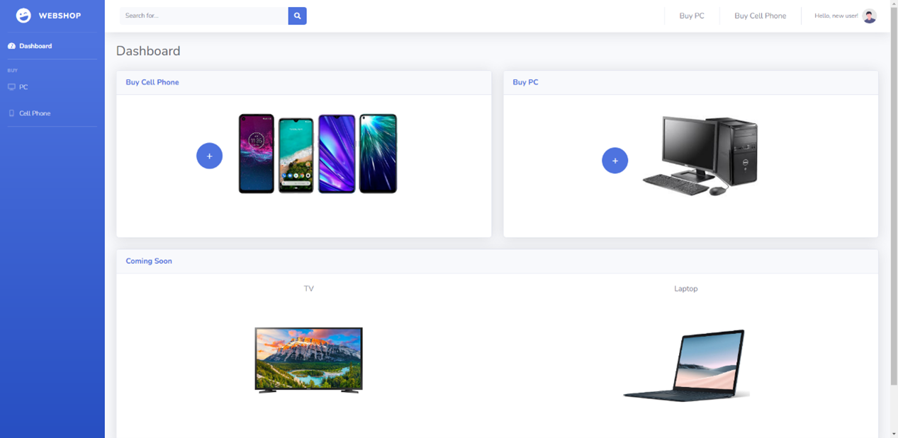

# Client and Server Side Programming Lab Project

Preview:

    

# Stacks
<b>Client:</b> HTML5 | CSS | JavaScript | Bootstrap
 
<b>Server:</b> Node.js
 
<b>Database:</b> PostgreSQL

# Assignments
* Login a user with reCAPTCHA varification.
* User registretion will be confirmed by encrypted link in email.
* Password reset will send encrypted link to get to update password page.
* Updating user details, confirm update with email.
* Database, passwords are encrypted.

